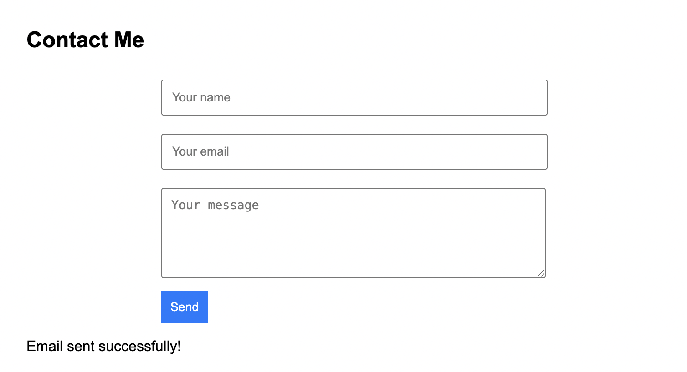

# Serverless Contact Form (AWS)

A fully serverless contact form built with **S3 + API Gateway + Lambda + SES**.

## Architecture
- Frontend: Static HTML form hosted on Amazon S3 (static website hosting).
- API: Amazon API Gateway HTTP API with a `/contact` POST route.
- Backend: AWS Lambda (Node.js 16) that receives the form data and sends an email via Amazon SES.
- Email: Amazon SES for sending notifications.

## Features
- Serverless (no backend servers to manage).
- Secure CORS setup for browser calls.
- Environment variables for sender and recipient email.
- Verified SES identities for safe sending.
- Simple design that can be styled or extended.

## Setup Instructions
1. Verify sender and recipient emails in Amazon SES (if SES sandbox).
2. Create a Lambda function with `index.js`.
   - Add env vars: `SENDER_EMAIL`, `RECIPIENT_EMAIL`.
   - Attach IAM policy to allow SES `SendEmail`.
3. Create an API Gateway HTTP API with route `POST /contact` → Lambda integration.
   - Enable CORS for `POST` and `OPTIONS`.
4. Host the `contact.html` file in an S3 bucket (static website hosting enabled).
5. Update the `contact.html` script with your API Invoke URL.
6. Test via curl and browser.

## Demo
Here’s the contact form hosted on S3:

## Future Improvements
- Add CAPTCHA or honeypot to prevent spam.
- Move SES out of sandbox (production).
- Custom domain with Route 53 + CloudFront.
- Deploy via IaC (CloudFormation or Terraform).